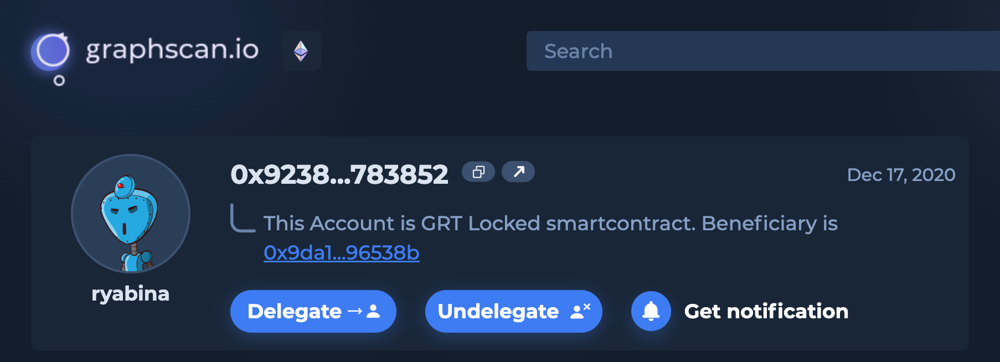

# Integration example

As an example of Web3alert integration, we can show [Graphscan.io](https://next.graphscan.io/profile?id=0x9238584c74e5fa445a8f72a4d4ef4699dd783852#indexer-details) - the explorer for The Graph protocol. To get notifications a user can click the “Get notification” button, pick the triggers, and add necessary info (i.e., address of filtering parameters). Some info is auto-inserted - like the indexer address or the user’s wallet address. To complete the subscription and to choose receiving channels (messengers or webhook), the user is redirected to the Web3alert website.

<figure><figcaption>
"Get notification" button 
</figcaption></figure>

<figure><figcaption>
A user can pick desired triggers for alerts. Indexer address is pre-filled
</figcaption></figure>

<figure><figcaption>
The user is redirected to Web3alert to choose messengers and complete a subscription
</figcaption></figure>
